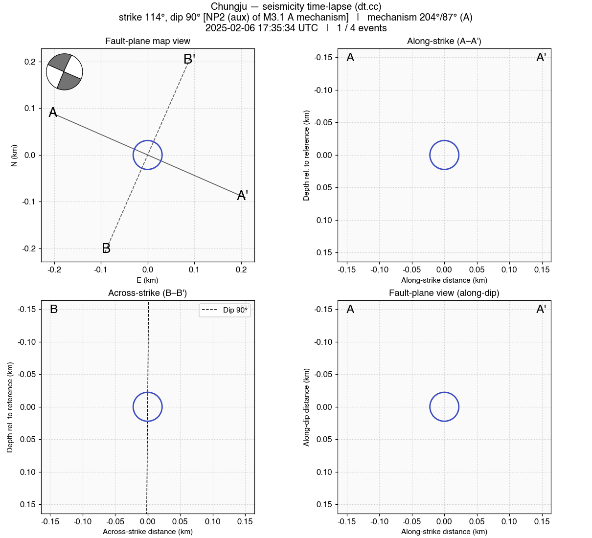
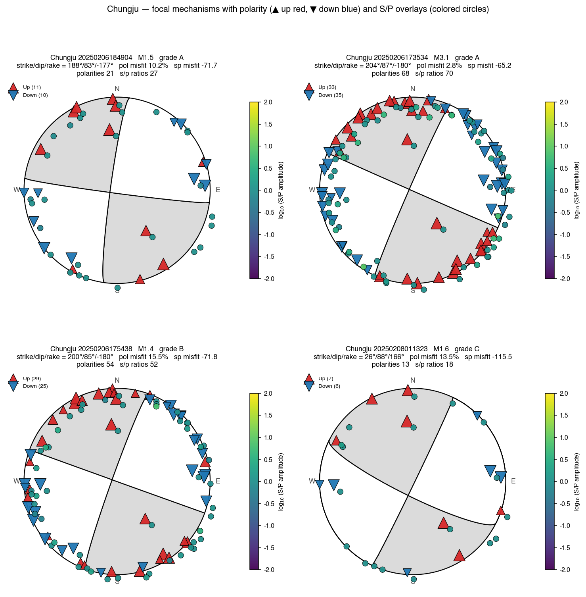
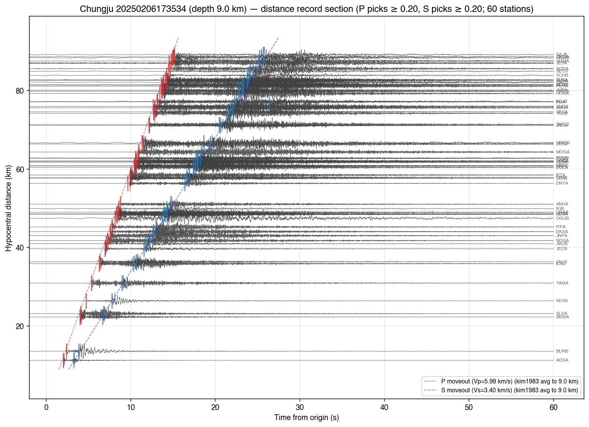
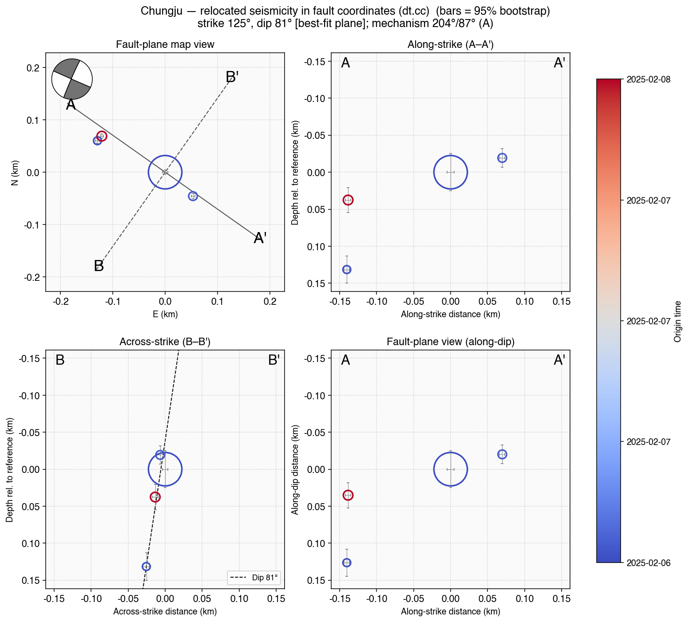

# PocketQuake

**From an event-catalog CSV to a relocation-summary notebook in one command.**



*The PocketQuake output for the 4-event [Chungju Feb 2025 sequence](examples/chungju/README.md) — a cumulative time-lapse animation in the same 2×2 fault-frame layout as `viz.fault_sections`: events appear in chronological order on top of the focal-mechanism beachball (A grade, near-vertical N–S right-lateral strike-slip). **One command from a 4-line CSV to this animation + the rest of the [results notebook](external/korea-cluster-relocation/pipeline/notebooks/03_results_chungju.ipynb): `./pocketquake.sh examples/chungju/chungju_catalog.csv chungju --fg`** (~15 min wall-clock).*

PocketQuake glues two existing projects:

- **[seismoseo/necis-downloader](https://github.com/seismoseo/necis-downloader)** — downloads KMA NECIS waveforms for a given event list.
- **[seismoseo/korea-cluster-relocation](https://github.com/seismoseo/korea-cluster-relocation)** — HypoDD relocation + SKHASH focal-mechanism pipeline.

For **older events** (pre-~2020) that NECIS no longer serves as downloadable event
segments, PocketQuake can fetch via **STP** (Seoul National University's SAC Transfer
Protocol at `mara.snu.ac.kr:46804`) instead — same one-command flow, just pass
`--source stp`. See [examples/sangju/](examples/sangju/README.md) for a 2018–2022 worked
example where the M3.9 mainshock and its aftershocks live in STP's archive but not in
NECIS's.

Given just a catalog CSV like

```
Year,Month,Day,Hour,Minute,Second,Latitude,Longitude,Magnitude,Depth
2025,2,7,2,35,34,37.14,127.76,3.1,9
2025,2,7,2,54,38,37.14,127.76,1.4,6
2025,2,7,3,49,4,37.14,127.76,1.5,7
2025,2,8,10,13,23,37.14,127.76,1.6,7
```

PocketQuake scaffolds a cluster, downloads the event waveforms, runs the picking → HypoDD → focal-mechanism chain, and produces an executed `03_results_<cluster>.ipynb` with epicenter maps, depth sections, fault-frame sections, bootstrap error bars, and beachballs.

### Worked example: chungju (4 events, Feb 2025)

The 4-event chungju sequence shipped under `examples/chungju/chungju_catalog.csv` is the
canonical PocketQuake example — small enough to run quickly (~15 min wall-clock end-to-end),
and dense enough to exercise every stage of the pipeline:

- **Locations** (HypoInverse, kim1983): 4 events at (37.142, 127.760), depths 7.3 → 10.2 km,
  RMS 0.22 – 0.28 s, ERH 0.2 km — all grade B.
- **Relative relocation** (dt.cc): cluster tightens to ±100 m around (37.142, 127.759, 7.2 km).
- **Focal mechanisms** (SKHASH): the M3.1 mainshock + two aftershocks are grade A/B
  near-vertical strike-slip (strike ≈ 200°, dip 84–87°, rake near ±180°); the smallest M1.6
  drops to grade C with 13.5% polarity misfit (visible in the custom beachball as off-quadrant
  triangles).

The `03_results_chungju.ipynb` showcases every PocketQuake visual: catalog map, depth
sections, distance record sections (Z traces ordered by hypocentral distance, P/S picks
overlaid against the depth-averaged moveout), the dt.cc relocation map, the
polarity-and-S/P-overlay beachball gallery, fault-frame sections, an interactive 3-D view,
and a polarity-quality panel. See `examples/chungju/README.md` (TODO) for the per-stage
walkthrough.

## Architecture

```text
┌──────────────────────┐
│  catalog CSV (KST)   │
└──────────┬───────────┘
           ▼
    pocketquake.orchestrate
           │
           ├──► scaffold cluster dir         (sibling of external/korea-cluster-relocation/pipeline/)
           ├──► necis-downloader  ──────►   kma_waveforms/<event_id>/{a,v}/SAC/<band>/…
           ├──► register cluster             (pipeline/clusters/<name>.py + config.py)
           ├──► korea-cluster-relocation:   stations → waveforms → picking (PhaseNet+)
           │                                → hypoinverse → ph2dt → dtct
           │                                → rereference → xcorr → dtcc
           │                                → focal_mechanism (SKHASH, A/B mechanisms)
           └──► 03_results_<cluster>.ipynb  (executed, headless)
```

Both upstream projects are included as **git submodules** under `external/`, so
`git clone --recurse-submodules` brings everything.

## Quickstart

```bash
git clone --recurse-submodules git@github.com:seismoseo/PocketQuake.git
cd PocketQuake
pip install -e .
pip install -e external/necis-downloader
playwright install chromium       # one-time, for NECIS scraping

cp .env.example .env              # then edit NECIS_USER / NECIS_PASS

# One-command wrapper (auto-derives epicenter + bounds from the catalog;
# runs in nohup background by default; pass --fg for foreground; --help for options):
./pocketquake.sh examples/changnyeong/changnyeong_catalog.csv mytest

# Full CLI form (when you want explicit control):
pocketquake examples/changnyeong/changnyeong_catalog.csv \
    --cluster changnyeong \
    --epicenter 35.463,128.427 \
    --region-bounds 35.3,35.65,128.25,128.65
```

`pocketquake.sh` is the friendly one-liner; it auto-derives the epicenter (catalog centroid)
and region bounds (catalog bbox + 0.2°), checks credentials, and chains the optional
Gwangyang-style mainshock treatment when you pass `--mainshock UTC_YYYYMMDDHHMMSS`.

## Gallery — what the notebook actually shows

These figures all come straight out of `03_results_chungju.ipynb` (no manual editing) — the full
catalog walkthrough is at [examples/chungju/README.md](examples/chungju/README.md).

**Per-event focal mechanisms with polarity + S/P overlays (v1.0.0):**



*Each panel = one event. Red ▲ = upward first motion, blue ▼ = downward (size ∝ polarity weight, position = (azimuth, takeoff) on the lower hemisphere). Offset colored circles = log₁₀(S/P amplitude ratio). The M3.1 grade-A mainshock (top-left) has 2.8 % polarity misfit — almost every triangle on the predicted side. The M1.6 grade-C event (bottom-right) has 13.5 % misfit — the off-quadrant triangles tell you exactly which stations the inversion can't fit.*

**Distance record section — picks vs depth-averaged moveout:**



*60 Z-component traces for the M3.1 mainshock, ordered by hypocentral distance. PhaseNet+ picks (red = P, blue = S) overlaid on the predicted moveouts at the kim1983 model's depth-averaged Vp/Vs down to the event focal depth. The picks lie right on the dashed lines — this is what PocketQuake's "your picks are good" QC looks like, automatically generated for every event.*

**Fault-coordinate sections (best-fit plane of the relocated cloud):**



*The dt.cc relocated cloud rotated into the SVD best-fit fault frame: fault-plane map view, along-strike depth section, across-strike depth section (dashed dip line), and the along-dip view. Markers coloured by origin time, sized by magnitude.*

That single command:

1. scaffolds `external/korea-cluster-relocation/changnyeong/{event_catalog,station_table,kma_waveforms}/`,
2. emits a `KS_station.csv` (404 stations) from the bundled `KP_station_list.csv`,
3. writes `pipeline/clusters/changnyeong.py` and registers it in `pipeline/config.py`,
4. downloads the 3 events from KMA NECIS,
5. runs the eq-cycle pipeline (PhaseNet+ picking + HypoDD + focal mechanisms),
6. writes and executes `pipeline/notebooks/03_results_changnyeong.ipynb`.

## What PocketQuake bundles (vs what is in the submodules)

| Bundled in PocketQuake | Lives in a submodule |
|---|---|
| `pocketquake/orchestrate.py` — the top-level workflow | NECIS scraping + ZIP organisation (`necis/`) |
| `pocketquake/scaffold.py` — cluster directory + config edits | Picking / HypoInv / HypoDD / SKHASH (`pipeline/`) |
| `pocketquake/necis_bridge.py` — async wrapper | Cluster configs for the four pilot clusters |
| `pocketquake/build_results_nb.py` — generates `03_results_<cluster>.ipynb` | Visualisation library (`pipeline/viz.py`) |
| `stations/KP_station_list.csv` — KMA master (404 KS + 61 KG) | — |
| `examples/changnyeong/` — test catalog | — |

PocketQuake stays lean (~10 files); upstream fixes flow in via `git submodule update --remote`.

## Prerequisites

Beyond Python 3.10+:

- **NECIS account** (`NECIS_USER` / `NECIS_PASS` in `.env`).
- **External binaries** on `PATH`: `hyp1.40`, `ncsn2pha`, `ph2dt`, `hypoDD`, `mseed2sac`.
- **PhaseNet+ weights**: `EQNET_DIR` + `EQNET_WEIGHTS` env vars (see the eq-cycle README).
- **SKHASH**: `SKHASH_DIR` env var (for focal mechanisms).
- A CUDA GPU is strongly recommended for PhaseNet+ picking; CPU works but is much slower.

## Local edits to the eq-cycle submodule

PocketQuake's scaffolder writes a cluster directory, a cluster module, and a small `config.py` edit into the **working tree** of the `korea-cluster-relocation` submodule. These are *local* changes — they are not committed from PocketQuake. If you want the cluster to become a permanent member of the framework, open a PR against [seismoseo/korea-cluster-relocation](https://github.com/seismoseo/korea-cluster-relocation) with those files.

## GitHub structure rationale

Why submodules and not pip-from-git or vendored copies?

| | submodules ✅ | pip-from-git | vendored copy |
|---|---|---|---|
| Works without packaging upstream | ✅ | ❌ (eq-cycle has no `pyproject.toml` yet) | ✅ |
| Preserves upstream history | ✅ | ✅ | ❌ |
| Single `git clone` brings everything | ✅ (`--recurse-submodules`) | ✅ | ✅ |
| Upstream fixes are one command away | `git submodule update --remote` | `pip install -U` | manual merge |
| End-user surface | needs a `--recurse-submodules` clone | cleanest | smoothest |

Submodules win for this case because the two upstreams have asymmetric packaging and PocketQuake is a thin orchestrator. If `korea-cluster-relocation` ever ships a `pyproject.toml`, we can switch to pip-from-git transparently.

## See also

- [`docs/workflow.md`](docs/workflow.md) — annotated walkthrough of the changnyeong run.
- [seismoseo/necis-downloader](https://github.com/seismoseo/necis-downloader) — NECIS scraper + ZIP extractor.
- [seismoseo/korea-cluster-relocation](https://github.com/seismoseo/korea-cluster-relocation) — the relocation pipeline.

## License

MIT
