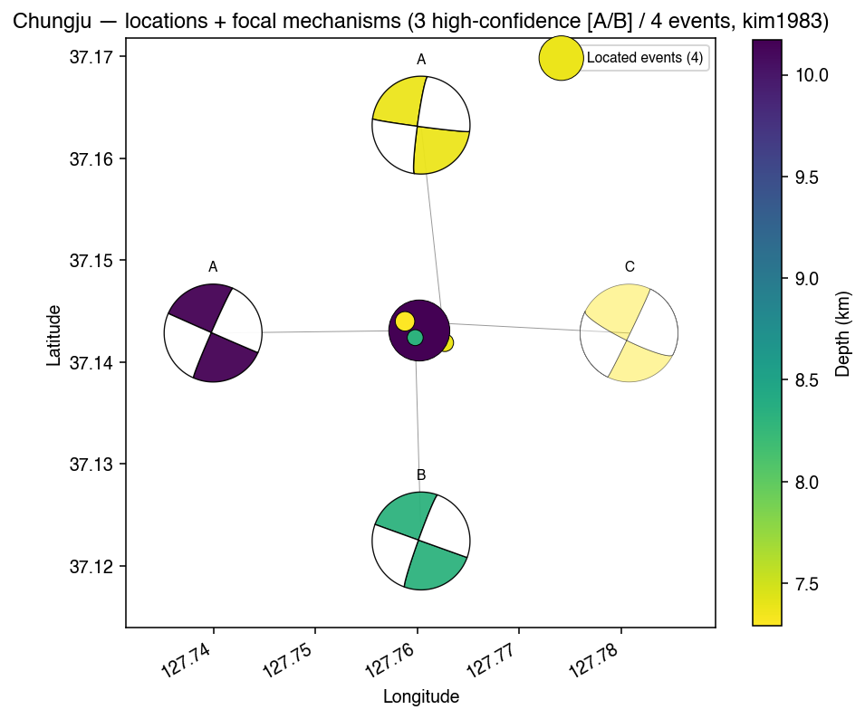
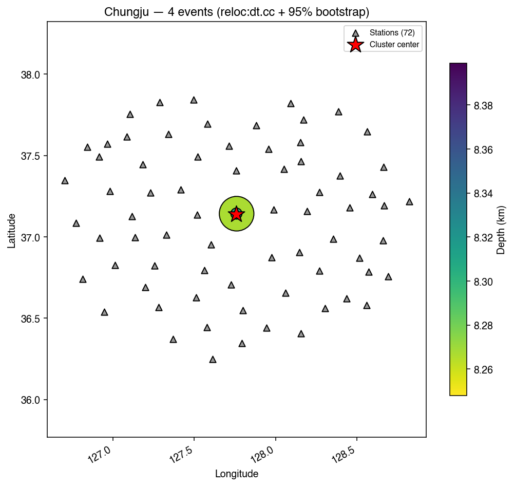
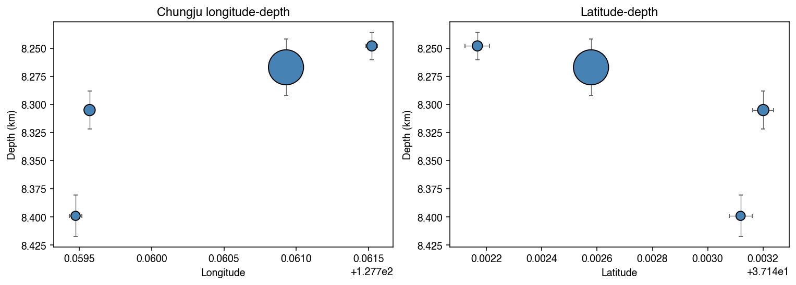
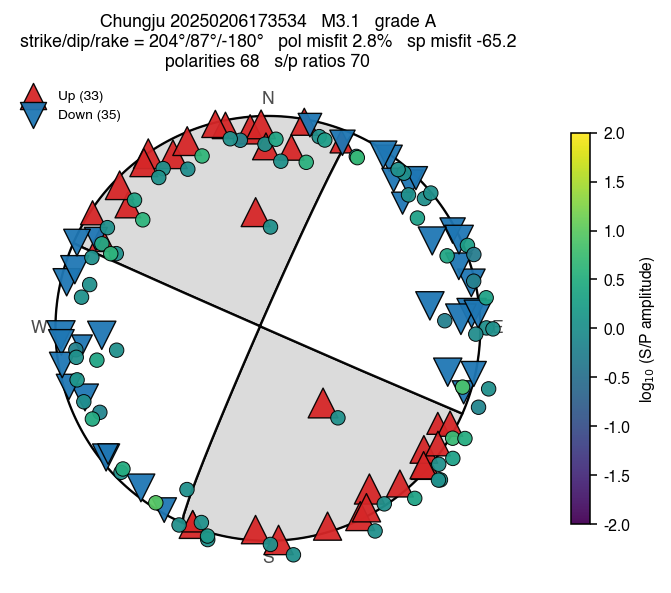

# Chungju (Feb 2025) — the headline PocketQuake example

A 4-event sequence in Chungju, central Korea (37.14°N, 127.76°E) from 6–8 February 2025. The
M3.1 mainshock was the largest local event of the season and was felt across the city;
the three M1.4–1.6 aftershocks followed in the next ~38 hours. Small enough to run the full
PocketQuake chain in roughly 15 minutes wall-clock, dense enough to exercise every stage —
this is the recommended first example after you finish the install.



*Four located events (dots, colored by depth) at (37.142°N, 127.760°E) with high-confidence focal-mechanism beachballs (A/B/C grade labelled) drawn on a leader-line ring so the tight cluster stays legible. All four solutions converge on a near-vertical N–S right-lateral strike-slip plane — the headline result from one PocketQuake command.*

## The input catalog

[`chungju_catalog.csv`](chungju_catalog.csv):

```csv
Year,Month,Day,Hour,Minute,Second,Latitude,Longitude,Magnitude,Depth
2025,2,7,2,35,34,37.14,127.76,3.1,9
2025,2,7,2,54,38,37.14,127.76,1.4,6
2025,2,7,3,49,4,37.14,127.76,1.5,7
2025,2,8,10,13,23,37.14,127.76,1.6,7
```

KST origin times (Korean Standard Time, UTC + 9 h). PocketQuake auto-derives the epicenter
(catalog centroid → 37.14 / 127.76) and the region bounds (bbox + 0.2°). The KMA-supplied
event coordinates are rounded to 2 decimal places, which is exactly why
HypoInverse-relocating these events ends up as a useful test — the ground truth has built-in
~1 km uncertainty.

## One-command run

```bash
cd PocketQuake
./pocketquake.sh examples/chungju/chungju_catalog.csv chungju --fg
```

The `--fg` keeps the run in the foreground so you can watch each stage report. Stages and
artifacts:

| Stage              | Output (`runs/chungju/`)                                   | Wall-clock      |
| ------------------ | ---------------------------------------------------------- | --------------- |
| scaffold + register| `Chungju_cluster/`, `pipeline/clusters/chungju.py`         | < 1 s           |
| NECIS download     | `Chungju_cluster/kma_waveforms/<event_id>/{a,v}/SAC/<band>/…` | 5–10 min        |
| stations           | `runs/chungju/station_table/used_stations_100km.csv` (72)   | < 1 s           |
| waveforms          | `runs/chungju/waveforms_100km/<event_id>/*.sac` (864)       | ~10 s           |
| picking (PhaseNet+)| `runs/chungju/picks/<event_id>_picks.csv`                   | ~30 s (GPU)     |
| hypoinverse        | `runs/chungju/1.HypoInv/{PHS,STA,kim1983,kim2011}/...`      | ~5 s            |
| ph2dt + dtct       | `runs/chungju/2.HypoDD/{00.ph2dt,01.dt.ct}/`                | ~10 s           |
| rereference        | re-anchors SAC headers to HypoInverse origins              | ~5 s            |
| xcorr              | `runs/chungju/2.HypoDD/02.dt.cc/dt.cc_0.7_combined`         | ~15 s (10 cores)|
| dtcc               | `runs/chungju/2.HypoDD/02.dt.cc/hypoDD.reloc`               | ~5 s            |
| focal_mechanism    | `runs/chungju/3.FocalMech/kim1983/mechanisms.csv`           | ~5 s            |
| build_results_nb   | `pipeline/notebooks/03_results_chungju.ipynb` (executed)    | ~3 min          |

## What you should see

### Absolute locations (HypoInverse, kim1983)

All 4 events converge on (37.142, 127.760), depths 7.3 – 10.2 km, RMS 0.22 – 0.28 s, ERH
0.2 km, **all grade B**. The M3.1 mainshock depth (~10 km) is sensitive to the velocity model
choice — switch to `--velmodels kim2011` to see how a one-extra-layer model adjusts it.


*Z-component traces for the M3.1 mainshock, ordered by hypocentral distance, with PhaseNet+ picks overlaid (red = P, blue = S). The dashed lines are the predicted moveouts at the **depth-averaged Vp/Vs of the kim1983 model down to the event focal depth** — the picks fall right on the prediction, which is exactly the visual QC PocketQuake gives you for free per event.*

### Relative relocations (dt.cc HypoDD)

The four events tighten to **±100 m** around (37.142, 127.759, 7.2 km depth). 479 dt.ct
entries from ph2dt and 6 event pairs × 72 stations of waveform cross-correlation feed the
relocation; the bootstrap error bars (95 % CI) are sub-100 m horizontal and ~300 m vertical.





*The dt.cc relocated cloud rotated into the **best-fit fault frame** (SVD of the relocated cloud): fault-plane map view (top-left, with strike + dip + the high-magnitude event's beachball annotation), along-strike depth section (top-right), across-strike depth section (bottom-left, dashed line = dip), and the along-dip fault-plane view (bottom-right). Markers are coloured by origin time and sized by magnitude.*

### Focal mechanisms (SKHASH)

Three high-confidence (grade A/B) solutions on a near-vertical, ~N–S striking right-lateral
fault — consistent with the regional stress field for central Korea (Park et al., 2023):

| event    | grade | strike  | dip    | rake     | polarity-misfit | num_pol | num_sp |
| -------- | ----- | ------- | ------ | -------- | --------------- | ------- | ------ |
| 200000 (M3.1) | **A** | 203.7° | 86.6°  | -179.5°  | 2.8 %           | 68      | 70     |
| 200001 (M1.4) | **B** | 199.8° | 84.9°  | -179.9°  | 15.5 %          | 54      | 52     |
| 200002 (M1.5) | **A** | 187.8° | 83.4°  | -177.0°  | 10.2 %          | 21      | 27     |
| 200003 (M1.6) | C / D | 25.8°  | 88.0°  | 165.9°   | 13.5 %          | 13      | 18     |

The M1.6 (200003) is multi-solution (two distinct local minima, both shown in the notebook)
because it has only 13 polarities — too few for the inversion to single out one plane. This
is exactly the kind of edge case the per-event beachballs make visible: the M1.6 panel shows
a handful of red triangles in white quadrants (polarity-misfit 13.5 %), where a clean grade-A
solution like the M3.1 has every triangle on the model-predicted side.

### Per-event beachball gallery (the v1.0.0 visualisation)

Each event's beachball overlays:

- Nodal planes (ObsPy `beach`, gray-filled compressional quadrants),
- **Polarity markers**: red ▲ for upward first motion (compressional, should land on a gray
  quadrant), blue ▼ for downward, sized by the SKHASH polarity weight,
- **S/P amplitude ratios**: a small offset circle, colored by log₁₀(S/P) on the viridis
  ramp — the secondary constraint SKHASH uses alongside polarities.

This replaces the old static SKHASH PNG: same nodal planes, but you can now see why each
quality grade was assigned (the misfit % is right there in the marker pattern).


*Each panel: nodal planes (gray = compressional first motion expected), triangles at each station's (azimuth, takeoff) position, colored circles for the S/P amplitude ratio. **M3.1, M1.4, M1.5 are grade A/B/A — almost every triangle lies in the expected quadrant** (polarity misfit 2.8–15.5 %). **M1.6 is grade C with 13.5 % polarity misfit** — visibly off-quadrant red triangles near N in the white quadrant tell you why the SKHASH inversion couldn't single out one plane.*

The M3.1 mainshock in detail:



*68 polarities (33 up, 35 down) and 70 S/P amplitude ratios, all consistent with a near-vertical N–S right-lateral plane (strike 204°, dip 87°, rake -180°). Polarity misfit 2.8 % is the lowest in the cluster — this is the SKHASH grade-A reference solution.*

## Files in this directory

- `chungju_catalog.csv` — the 4-event input catalog (KST times, KMA columns).
- `README.md` — this file.

The generated cluster module (`pipeline/clusters/chungju.py`), source-root tree
(`external/korea-cluster-relocation/Chungju_cluster/`), and notebook
(`pipeline/notebooks/03_results_chungju.ipynb`) live inside the eq-cycle submodule and are
git-ignored from PocketQuake. They're rebuilt on demand by `./pocketquake.sh`.
