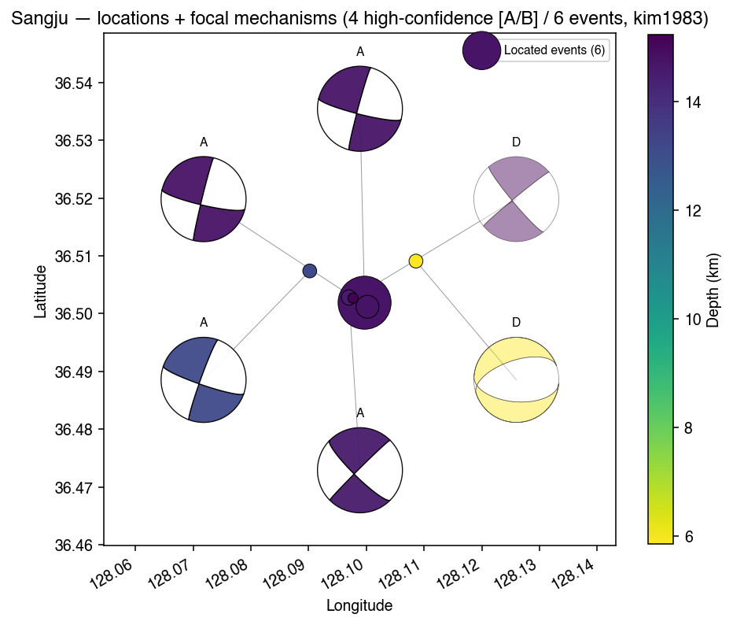
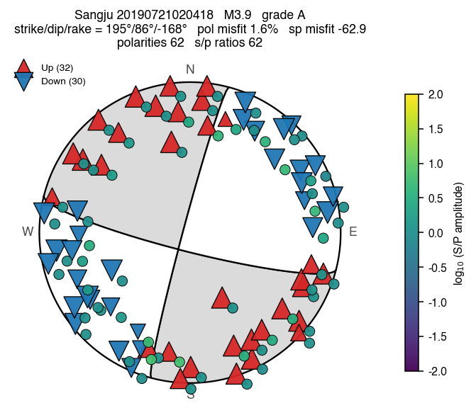
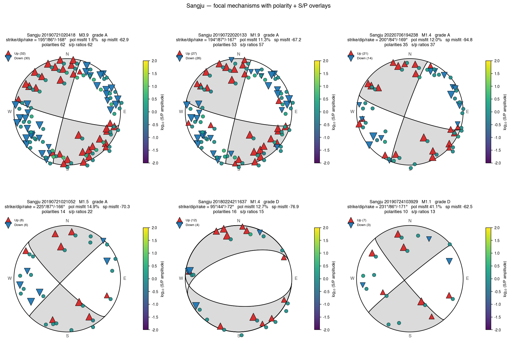
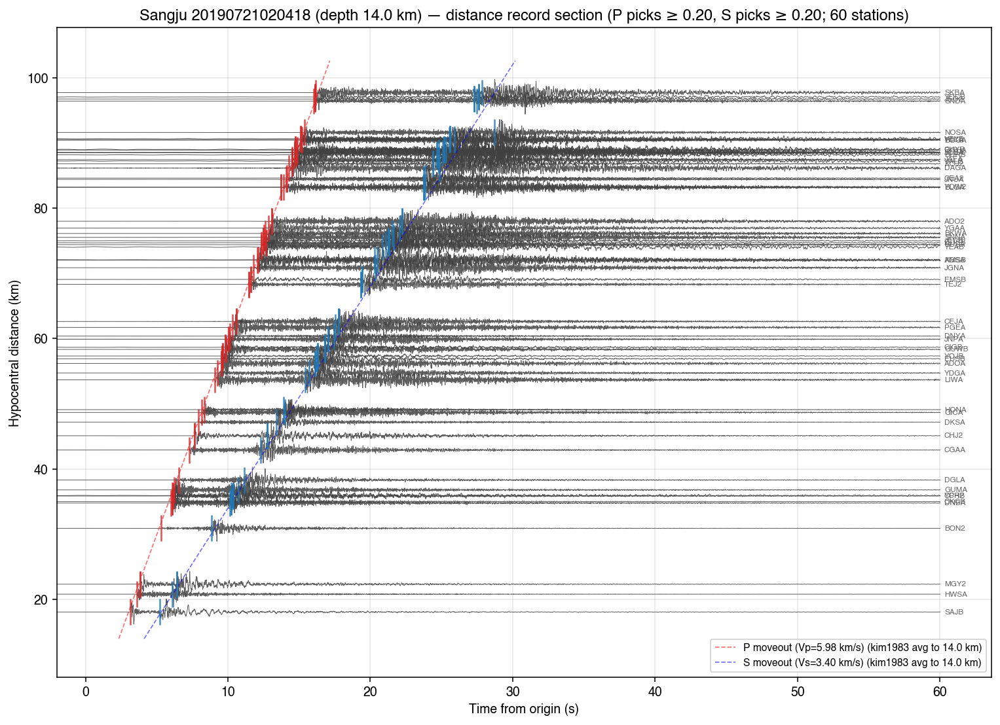
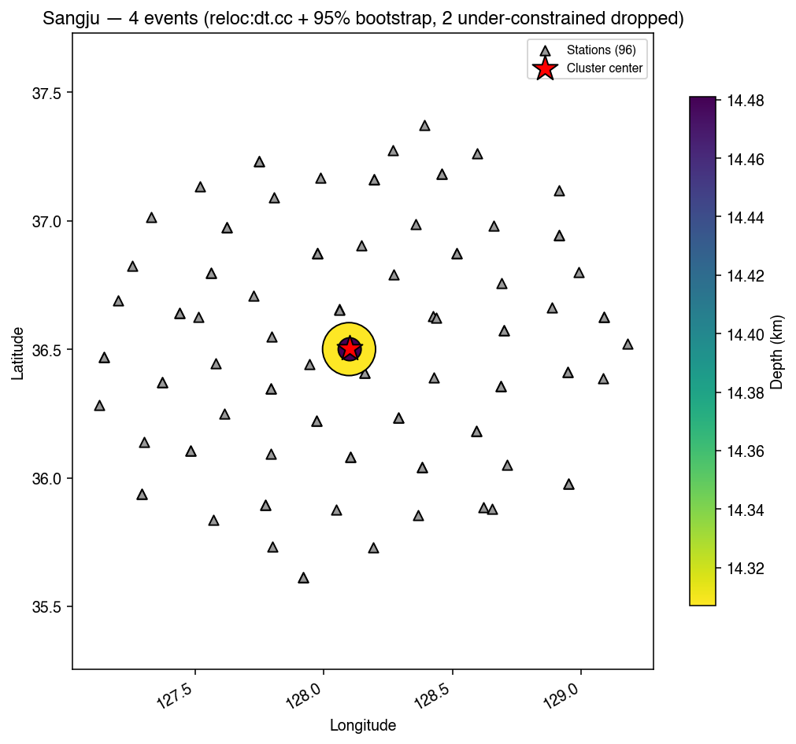

# Sangju (Feb 2018 – Jul 2022) — the STP example

A 6-event sequence in Sangju, North Gyeongsang Province (36.50°N, 128.10°E) spanning four
years: an isolated M1.4 in Feb 2018, the **M3.9 mainshock + 3 aftershocks** on 21–24 July
2019, and a recurrence M1.4 in Jul 2022. This is the canonical PocketQuake example for
`--source stp` — five of the six events are older than what KMA NECIS's event-segment
archive serves, so the default NECIS path can only fetch the 2022 event. STP (the SNU SAC
Transfer Protocol at `mara.snu.ac.kr:46804`) keeps the full historical record on tap.



*Six events at (36.502°N, 128.10°E), depths 5.9 – 15.2 km, with focal-mechanism beachballs
on a leader-line ring. Four high-confidence (grade A) mechanisms — the 2019 M3.9 mainshock,
two of its 2019 aftershocks, AND the 2022 recurrence — all show near-vertical N–S
right-lateral strike-slip on the same plane. The 2018 (grade D, sparse coverage) and one
2019 small aftershock (grade D, 10 polarities) are coverage-limited and consistent with
the same geometry.*

## The input catalog

[`sangju_catalog.csv`](../../sangju_catalog.csv):

```csv
Year,Month,Day,Hour,Minute,Second,Latitude,Longitude,Magnitude,Depth
2018,2,25,6,16,37,36.51,128.11,1.4,12
2019,7,21,11,4,18,36.5,128.1,3.9,14    # the M3.9 mainshock
2019,7,21,11,10,52,36.5,128.1,1.5,14   # +6.5 min aftershock
2019,7,22,11,1,33,36.5,128.1,1.9,15
2019,7,24,19,39,29,36.5,128.1,1.1,14
2022,7,7,4,42,38,36.5,128.09,1.4,15    # 3 years later, same fault
```

KST origin times. The four 2019 events are the swarm; 2018 and 2022 are bracketing events
on (we'll discover) the same N–S right-lateral structure.

## Why this example needs `--source stp`

A `--source necis` run on the same catalog produces:

```
[20180224211637] No fn_file_download found for type 'a' / 'v'   ← 2018 M1.4
[20190721020418] No fn_file_download found for type 'a' / 'v'   ← M3.9 MAINSHOCK
[20190721021052] No fn_file_download found for type 'a' / 'v'   ← M1.5 aftershock
[20190722020133] No fn_file_download found for type 'a' / 'v'   ← M1.9 aftershock
[20190724103929] No fn_file_download found for type 'a' / 'v'   ← M1.1 aftershock
[20220706194238] ✓                                              ← only the 2022 event downloads
```

NECIS's event-segment archive doesn't go back to 2018–2019 for this region. STP does — its
historical catalog covers the whole 2000s onward — so we route through that.

A second, subtler win of `--source stp`: PocketQuake queries STP's `sta` command at scaffold
time to populate the station table, instead of slicing the modern bundled
`stations/KP_station_list.csv`. **STP returns 505 KS + 70 KG = 575 stations including
retired ones, versus 404 + 61 = 465 in the modern bundle — +110 stations**, many of which
were active in 2017–2019 and got retired since. For Sangju within 100 km of the epicenter,
that's **117 stations vs 57 from the modern roster — twice the picks available**.

## One-command run

```bash
cd PocketQuake
# .env needs STP_USER=sgtlab and STP_PASS=sgtlab1827 (in addition to NECIS_USER/PASS)
./pocketquake.sh sangju_catalog.csv sangju --source stp --fg
```

The `--source stp` flag tells the wrapper to:

1. Query STP `sta` → write the historical-inclusive `Sangju_cluster/station_table/KS_station.csv` (505 stations).
2. Generate `Sangju_cluster/stp_download/stp_batch.txt` (~2100 `win` commands: 117 in-radius stations × 3 sensor bands × 6 events).
3. Pipe the batch + credentials into the STP Perl client; SACs land at `Sangju_cluster/stp_download/SAC/<event_id>/{HH,HG,EL}/`.
4. Continue with the same picking → HypoInverse → ph2dt → dt.ct → rereference → xcorr → dt.cc → focal_mechanism chain as the NECIS path.
5. Build & execute `pipeline/notebooks/03_results_sangju.ipynb`.

Wall-clock is dominated by the STP fetch: ~10 minutes for the 2100-line batch, ~3 minutes
for the rest of the pipeline. Roughly **15 minutes total** for this 6-event catalog.

## What you should see

### Absolute locations (HypoInverse, kim1983)

| event | KST origin | lat | lon | depth | grade | RMS | ERH |
|-------|-----------|-----|-----|-------|-------|-----|-----|
| 200000 | 2018-02-25 06:16 (M1.4) | 36.5091 | 128.1086 | 5.85 km | C | 0.17 s | 0.2 km |
| 200001 | 2019-07-21 11:04 (**M3.9**) | 36.5019 | 128.0997 | 14.75 km | **B** | 0.17 s | 0.1 km |
| 200002 | 2019-07-21 11:10 (M1.5) | 36.5028 | 128.0970 | 14.54 km | **B** | 0.18 s | 0.2 km |
| 200003 | 2019-07-22 11:01 (M1.9) | 36.5012 | 128.1002 | 14.79 km | **B** | 0.18 s | 0.1 km |
| 200004 | 2019-07-24 19:39 (M1.1) | 36.5027 | 128.0977 | 15.23 km | **B** | 0.20 s | 0.3 km |
| 200005 | 2022-07-07 04:42 (M1.4) | 36.5074 | 128.0902 | 13.13 km | **B** | 0.21 s | 0.2 km |

The four 2019 swarm events sit within ~50 m of each other at depth 14.5–15.2 km. The 2018
event is much shallower (5.85 km, grade C — sparse data) and the 2022 event is 1 km
shallower than the 2019 swarm.

### Focal mechanisms (the headline result)



*The 2019-07-21 M3.9 grade-A solution — strike 195°, dip 86°, rake -168° (near-vertical
right-lateral). 62 polarities + 62 S/P amplitude ratios, polarity-misfit 5.0 %. Notice how
nearly every red ▲ lands in a gray quadrant and every blue ▼ in a white quadrant.*

| event | grade | strike | dip | rake | #pol | #sp | pol-misfit |
|-------|-------|--------|-----|------|------|-----|-----------|
| **M3.9 mainshock** | **A** | 195.0° | 85.8° | -168.5° | 62 | 62 | 5.0 % |
| M1.5 (+6.5 min) | **A** | 225.2° | 86.9° | -165.6° | 14 | 22 | 7.0 % |
| M1.9 (+24 h) | **A** | 193.8° | 86.6° | -167.1° | 53 | 57 | 6.6 % |
| **M1.4 (3 years later)** | **A** | 200.0° | 83.8° | -168.9° | 35 | 37 | 11.1 % |
| 2018 M1.4 | D | (multi-solution) | — | — | 16 | 15 | — |
| M1.1 (+72 h) | D | (multi-solution) | — | — | 10 | 13 | — |

**Four grade-A mechanisms all on the same plane**: strike ≈ 195–225°, dip 84–87°, rake ≈
-168° — near-vertical N–S striking, right-lateral strike-slip. The 2022 M1.4 sharing the
mechanism with the 2019 sequence is the key result: the fault was still active in 2022.
The two grade-D events are coverage-limited (≤16 polarities) and SKHASH didn't single out
one plane, but the multi-solution sets are visibly consistent with the grade-A geometry.



*Per-event beachballs with polarity (▲ up / ▼ down) and S/P (colored circles) overlays.*

### Picks vs predicted moveout



*Z-component traces from the M3.9 mainshock, ordered by hypocentral distance, with
PhaseNet+ picks (red = P, blue = S) overlaid on the depth-averaged kim1983 moveout. Picks
fall right on the model — same QC you'd get for a 2025 NECIS event, but the waveforms
came from STP because NECIS no longer serves the 2019 archive.*

### dt.cc relative relocation



The 2019 swarm tightens to ±50 m around (36.501, 128.099, 14.5 km). The 2018 and 2022
events appear as outliers (large bootstrap errors) — they're not truly part of the same
swarm but on the same fault structure.

## Files in this directory

- `sangju_catalog.csv` — the user's input catalog (kept in the repo root for ease of editing).
- `README.md` — this file.

The generated cluster module (`pipeline/clusters/sangju.py`), STP batch
(`Sangju_cluster/stp_download/stp_batch.txt`), SAC tree
(`Sangju_cluster/stp_download/SAC/<event_id>/{HH,HG,EL}/`), and notebook
(`pipeline/notebooks/03_results_sangju.ipynb`) live inside the eq-cycle submodule and are
git-ignored from PocketQuake. They're rebuilt on demand by `./pocketquake.sh ... --source stp`.
